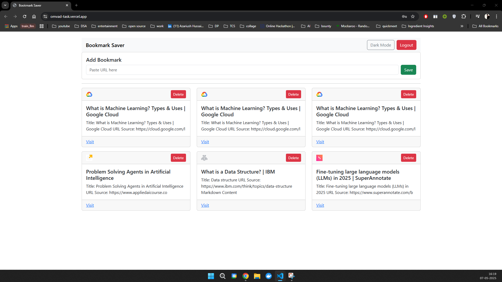
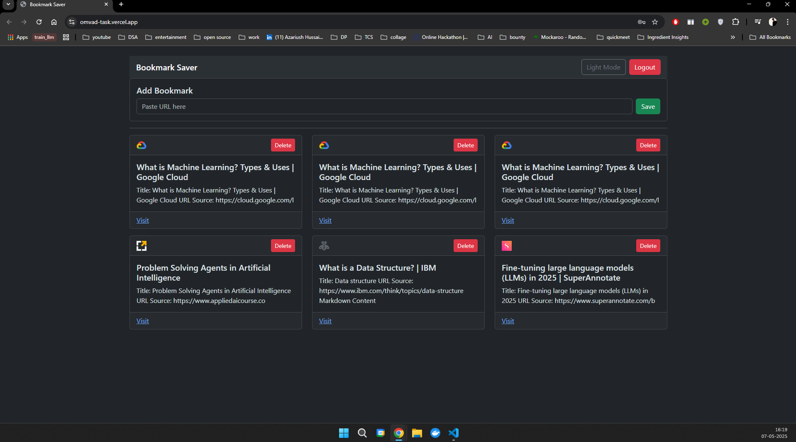
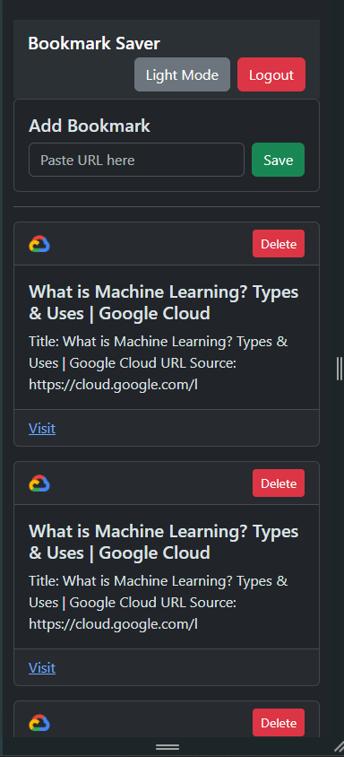
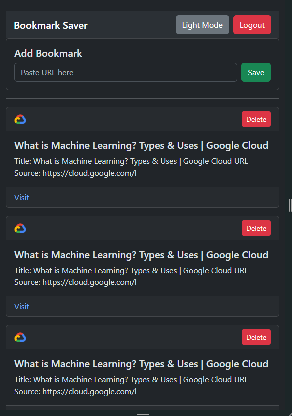

# 🚀 Bookmark Saver App

A simple app to save bookmarks:  
🔗 **Paste any URL → fetch title, favicon, and summary**  
💬 **Generates a text summary using Jina AI's open endpoint (no paid key)**

---

## 🌐 Tech Stack

- **Frontend:** React (with dark mode + responsive grid/list)
- **Backend:** Node.js + Express
- **APIs:**
  - Jina AI open endpoint (text summarization)
  - Website metadata (title, favicon, OpenGraph tags)
- **Testing:** Jest + React Testing Library (frontend), Jest + Supertest (backend)
- **Other:**
  - Dark mode toggle
  - Responsive design

---

## 🛠️ Setup Instructions

### 1️⃣ Clone the Repo

```bash
git clone https://github.com/your-username/bookmark-saver.git
cd bookmark-saver
```

### 2️⃣ Install Dependencies

```bash
# For backend
cd backend
npm install

# For frontend
cd ../frontend
npm install
```

### 3️⃣ Run Locally

```bash
# For backend
cd backend
npm start

# For frontend
cd frontend
npm run dev
```

### 4️⃣ Environment Variables

```bash
# For backend
MONGODB_URI=YOUR_MONGODB_URI
JWT_SECRET=YOUR_JWT_SECRET
TOKEN_EXPIRATION=TOKEN_EXPIRATION_DURATION
FRONTEND_URL=FRONTEND_URL


# For frontend
VITE_API_URL=BACKEND_URL
```

###🎯 Features
✅ Save any URL

✅ Auto-fetch:

  * Title (via document.title)
  
  * Favicon (/favicon.ico or OpenGraph tags)

✅ Generate summary using Jina AI open API

✅ List & view bookmarks (grid/list responsive view)

✅ Delete any bookmark

✅ Dark mode toggle


### 📸 Screenshots

* Light Mode


* Dark Mode
	

* Responsive view


* Responsive View

### ✅ What I’d Do Next

* 🚥Implement redux snd improve frontend code.
* 🔄 Sync: with browser bookmark API
* 📁 Folders/tags: to organize bookmarks
* 🚥 Better error handling: for failed URL fetches / summary generation


### ⏱️ Time Spent
⌛ ~5–6hours total:

~1h: setup & boilerplate

~2h: core functionality (fetching, summarizing, saving)

~1.5h: UI polish (dark mode, grid/list)

~1h: Deployment


* Note:
  Please be aware that the app fetches metadata (title, favicon, etc.) from external websites. If a website has blocked automated requests or uses protection mechanisms (e.g., CORS restrictions, bot detection), the fetch may fail and display an error when trying to add that bookmark.

	Example: Some sites like GeeksforGeeks may block such requests.
